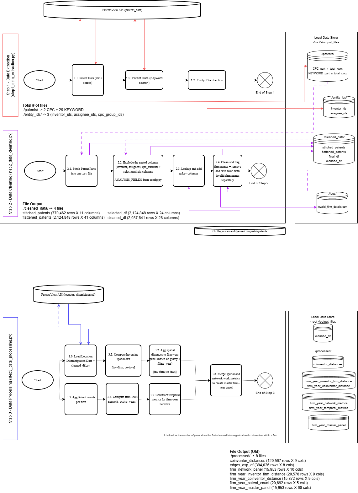

# PatentsView API Client

A **Python client** for accessing patent data through the **PatentsView Search API** using your personal API key. Designed to help researchers gather inventor–organization–patent data for innovation and network analysis.


## Author

Developed by [Sabesh Rajamanikam](https://www.linkedin.com/in/sabesanhari/), MSc Management of Technology student at TU Delft,  
for research on intra-organizational inventor networks and innovation impact.


## Release

This branch is the **stable, thesis-submission version** of the pipeline:

🔗 [Release Branch — patentsview_api_client](https://github.com/sabesanhariR/patentsview_api_client_release)

> Preserved for reproducibility. No active development occurs on this branch.

---

## Features
- Securely connects to the [PatentsView Search API](https://search.patentsview.org/docs/docs/Search%20API/SearchAPIReference/)
- Automated pagination through all results
- Two-stage patent extraction (CPC-based + keyword-based)
- Incremental saving to avoid data loss
- Configurable for different patent queries (keyword, assignee, inventor, year)
- Robust data cleaning and relational flattening
- Produces a panel-ready flat file with patent-level metadata, inventor-assignee combinations, and primary CPC classification
- Static and dynamic network metrics at the firm-year level
- Haversine distance computation between co-inventors and between inventors and their firm


## Setup Instructions

### Clone and install dependencies
```bash
git clone https://github.com/sabesanhariR/patentsview_api_client.git
cd patentsview_api_client
pip install -r requirements.txt
```

### Dependencies
```bash
requests==2.32.3
python-dotenv==1.1.0
pandas==2.2.3
openpyxl==3.1.5
networkx==3.4.2
geopy==2.4.1
pathlib
scikit-learn==1.6.1
stargazer==0.0.7
statsmodels==0.14.4
```

### Environment Setup
Create a `.env` file in the root directory with your PatentsView API key: `API_KEY=your_api_key_here`

---

## Pipeline Overview

The pipeline consists of three sequential processing steps, followed by an exploratory analysis notebook.



### Step 1 — Data Extraction (`step1_data_extraction.py`)

Extracts patent data from the PatentsView API in two stages:
- **Stage 1 (CPC-based)**: Queries patents by specific CPC group codes and year range
- **Stage 2 (Keyword-based)**: Queries patents by keywords (e.g., "urban mining", "e-waste"), deduplicating against Stage 1 results
- **Entity ID extraction**: Saves unique `inventor_ids`, `assignee_ids`, and `cpc_group_ids` to `./entity_ids/`

**Output** — `./patents/`: 2 CPC + 29 KEYWORD part files

---

### Step 2 — Data Cleaning (`step2_data_cleaning.py`)

Transforms raw extracted data into a clean, analysis-ready flat file:
1. **Stitch** all patent part files into one CSV (`stitched_patents`: 770,462 rows × 11 cols)
2. **Flatten** nested columns (`inventors`, `assignees`, `cpc_current`) using cartesian product, retaining only `ANALYSIS_FIELDS` (`flattened_patents`: 2,124,848 rows × 41 cols)
3. **Lookup** and add `gvkey` firm identifiers via [arnauddyevre/compustat-patents](https://github.com/arnauddyevre/compustat-patents)
4. **Clean** firm names — invalid rows are saved separately to `./logs/invalid_firm_details.csv`

**Output** — `./cleaned_data/`: `cleaned_df` (2,037,641 rows × 28 cols)

---

### Step 3 — Data Processing (`step3_data_processing.py`)

Builds the firm-year master panel with spatial and network metrics:
1. **Load** `g_location_disambiguated.tsv` from PatentsView to map `location_id` to lat/long coordinates
2. **Compute** Haversine distances for co-inventor pairs and inventor-firm pairs, with NUTS-based regional affiliation
3. **Aggregate** spatial distances to firm-year level (by `gvkey` + `filing_year`)
4. **Compute** `network_active_years` per firm (years since first intra-organisational co-invention)
5. **Construct** static firm-year network metrics using `networkx`
6. **Construct** temporal (lagged + delta) network metrics
7. **Merge** all spatial and network metrics into `firm_year_master_panel.csv`

**Output** — `./processed/`: `firm_year_master_panel` (15,953 rows × 60 cols)

---

### Step 4 — Descriptive Analysis (`master_panel_analysis/models_V4.ipynb`)

An independent Jupyter notebook for exploratory analysis. Copy `firm_year_master_panel.csv` into the `master_panel_analysis/` folder and run the notebook to produce temporal, structural, and spatial diagnostics.

---

## Example Usage

Configure your query in `config.py`, then run:
```bash
python main.py
```

Example query snippet:
```python
query = '{"_and":[{"_gte":{"patent_year":2015}},{"_text_any":{"patent_title":"AI"}}]}'
fields = '["patent_id","patent_title","inventors.inventor_id","assignees.assignee_organization"]'
```

Output files are saved as `.csv` under `<root>/output_files/` (configurable via `OUTPUT_DIR` in `config.py`).

---
---

#### Author's Note:
_"If it's mean to be, it will come to you!_

_Happy Coding! Cheers :)"_

_Sabesh Rajamanikam, 30 March 2026 15:00 Delft, NL_

---
---
